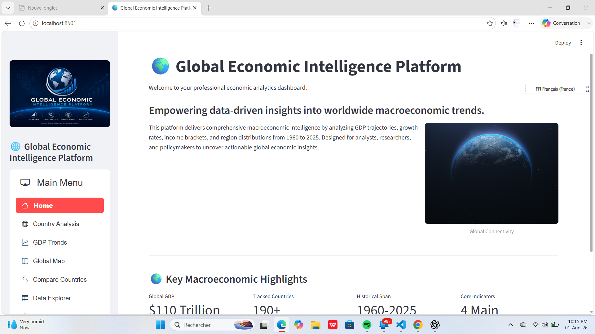
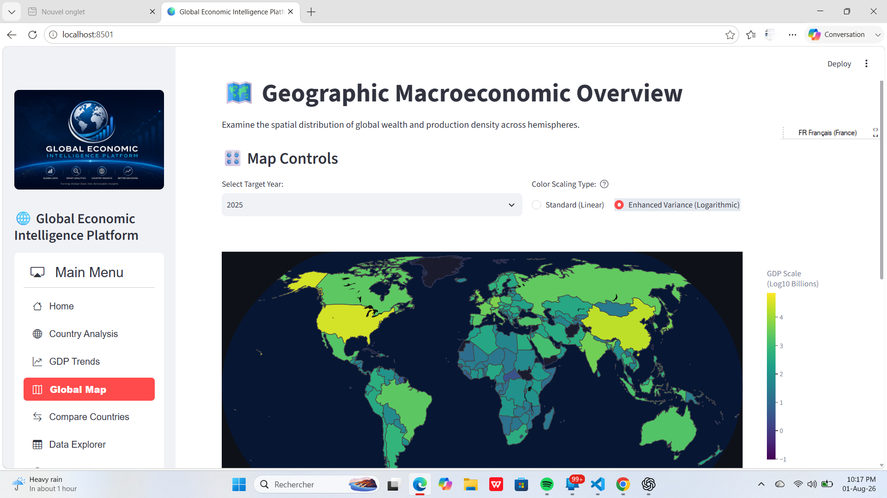
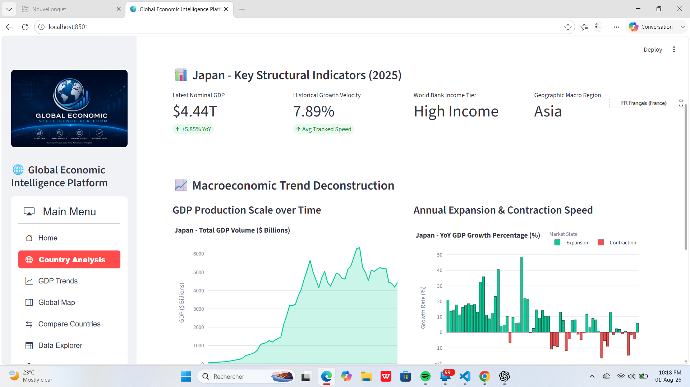
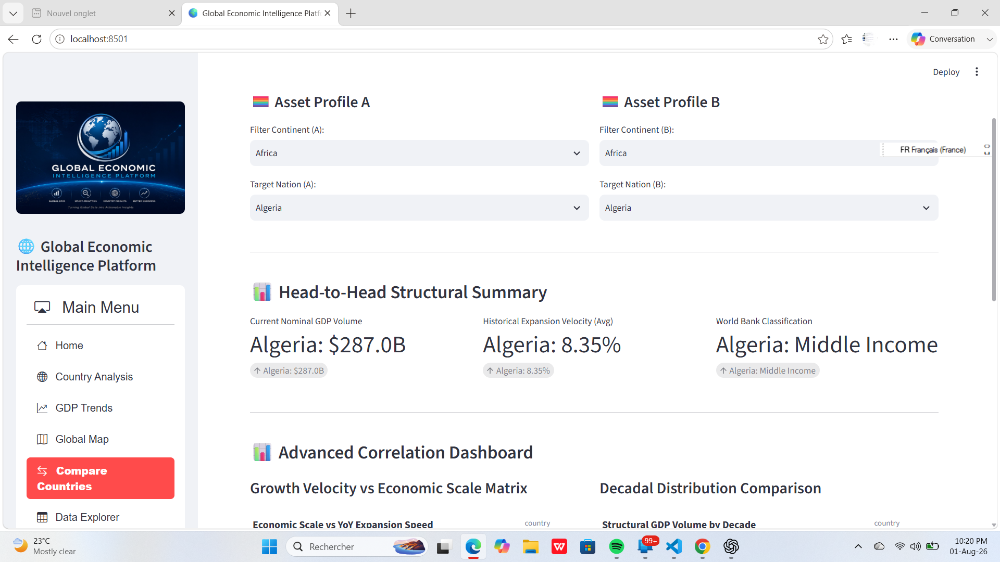
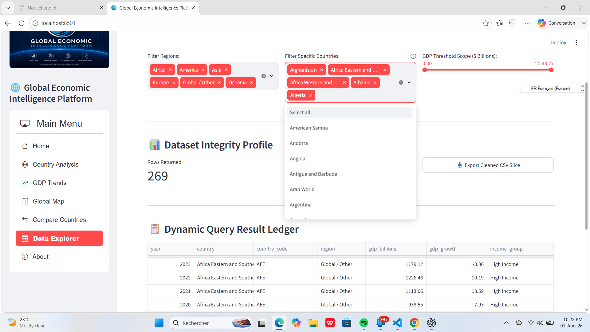

# 🌍 Global Economic Intelligence Platform

An interactive dashboard built with Python, SQL, and Streamlit to analyze global GDP trends from 1960 to 2025. The project demonstrates data cleaning, exploratory data analysis, and interactive visualization using World Bank data.


**🔗 Live Application:** [Launch Global Economic Intelligence Platform](https://global-economic-intelligence-platform-aka9orzkazdl5vtuu8wjpb.streamlit.app/)
**💼 Professional Portfolio:** [Mylene Gadeau on LinkedIn](https://linkedin.com/in/nicole-gadeau/)

---

## 📷 Dashboard Preview

### 🏠 Home Page (Central Hub Interface)


<details>
<summary><b>👀 Click to expand and view remaining dashboard pages</b></summary>

### 🗺️ Global GDP Map (Logarithmic Scale Mapping)


### 📈 Country Analysis (Conditional Market Shock Modeling)


### 📊 Country Comparison (Relational Variable Scatter Matrix)


### 🗂️ Dynamic Data Explorer (RAM Tracker Sandbox)


### ℹ️ Project Architecture & About Page


</details>

---

## 🎯 Project Overview
The goal of this project is to transform raw, noisy World Bank GDP datasets into a secure, intuitive business intelligence ecosystem. This platform handles severe wealth distribution skews and filters structural data anomalies, allowing developers, economists, and recruiters to extract clean economic insights instantly.

### Core End-User Functional Capabilities:
*   Compare economic indicators across multiple countries.
*   Explore GDP trends and growth over time.
*   Visualize regional and global economic patterns using interactive maps.
*   Filter, search, and download customized datasets for further analysis.

---

## ✅ Skills Applied in This Project

- **Data Cleaning & Preparation:** Cleaned and standardized datasets by handling missing values, removing duplicates, and ensuring consistent country names and formats.
- **Exploratory Data Analysis (EDA):** Analyzed GDP trends, growth patterns, and regional economic performance to uncover meaningful insights.
- **Data Visualization:** Created interactive charts and maps using Plotly to present complex economic data in a clear and interactive way.
- **Dashboard Development:** Built an interactive multi-page dashboard in Streamlit with filters, search functionality, and downloadable datasets.
- **Geospatial Analysis:** Mapped countries to continents and visualized global economic indicators using choropleth maps.
- **Python & Data Analysis:** Used Python, Pandas, and SQL to clean, transform, and analyze economic data.
- **Problem Solving:** Designed visualizations and interactive features to make large datasets easier to explore, compare, and interpret.

---

## 🛠️ Technologies Used

| Tool | Purpose |
| :--- | :--- |
| **Python** | Used to clean, analyze, and process data, as well as build the dashboard logic. |
| **Pandas** | Used for data cleaning, transformation, filtering, and analysis. |
| **Plotly Express** | Used to create interactive charts and maps for data visualization. |
| **Streamlit** | Used to build and deploy the interactive web dashboard. |
| **Country Converter** | Used to standardize country names and map countries to continents and ISO-3 codes. |
| **SQL** | Used to query and analyze structured economic data. |
| **Git & GitHub** | Used for version control, project documentation, and code sharing. |

---

## 🚀 Dashboard Features

- ✔ **Interactive Filters:** Explore data by selecting different countries, regions, continents, and years.
- ✔ **GDP Trend Analysis:** Visualize how a country's GDP has changed over time with interactive charts.
- ✔ **Growth Rate Analysis:** Compare annual GDP growth and identify periods of economic expansion or decline.
- ✔ **Global GDP Map:** Explore worldwide GDP distribution using an interactive choropleth map with optional logarithmic scaling.
- ✔ **Country Comparison:** Compare economic performance across multiple countries using interactive visualizations.
- ✔ **Download Data:** Export filtered datasets as CSV files for further analysis.
- ✔ **Responsive Dashboard:** Navigate between multiple dashboard pages with a clean and user-friendly interface.

---

## 🗺️ Project Workflow Diagram

```text
World Bank Dataset ──> Data Cleaning ──> Data Transformation ──> Exploratory Analysis ──> Interactive Dashboard ──> Business Insights
```

---

## 🧹 Data Preparation & Pipeline Controls
Before generating visualizations, raw ingestion logs pass through a strict processing pipeline (`data_cleaning.py`) to enforce database integrity:
*   **Anomaly Handling:** Removes aggregated and non-country entities (e.g., World, IDA Total) by identifying global financial reporting classifications that could distort country-level analysis.
*   **String Reformation:** Strips suffix titles like `", The"` and formats values into proper names (e.g., `"The Bahamas"`).
*   **Matrix Collapsing:** Evaluates comma-separated geographic vectors generated by mapping modules, converting them into clean singular labels.
*   **Metric Injections:** Implements mathematical formulas to calculate historical YoY growth speeds safely (`.pct_change() * 100`).

---

## 📂 Repository Structure

```text
Global-Economic-Intelligence-Platform/
│
├── assets/
│   ├── logo.jpg                 # Brand identity assets
│   ├── profile.png              # Profile media asset
│   └── world.jpg                # Home page branding graphic
│
├── data/
│   ├── gdp_cleaned.csv          # Cleaned master database ledger
│   └── gdp_data.csv             # Raw data source input file
│
├── images/
│   └── home.png                 # Main hub view visual clip
│
├── notebooks/
│   ├── exploration.ipynb        # Initial exploratory analysis scratchpad
│   └── visualisation.ipynb      # Chart rendering playground
│
├── reports/ 
│   └── Executive_Macroeconomic_Summary.md  # Data findings and business insights summary report
│                   
├── src/
│   ├── data_cleaning.py         # Primary data preparation pipeline script
│   └── data_collection.py       # Source data gathering utility script
│
├── app.py                       # Core routing application file running Streamlit
├── requirements.txt             # Cleaned production dependency tracker
└── README.md                    # Technical documentation manual portfolio
```

---

## ⚙️ Installation & Local Infrastructure Boot
Follow this setup sequence to run a local clone of the platform environment:

1. **Clone project structure:**
   ```bash
   git clone https://github.com[mylenegadeau-lang]/Global-Economic-Intelligence-Platform.git
   cd Global-Economic-Intelligence-Platform
   ```
2. **Initialize python execution sandbox:**
   ```bash
   python -m venv venv
   # On Windows environments:
   venv\Scripts\activate
   # On macOS/Linux environments:
   source venv/bin/activate
   ```
3. **Execute software dependencies install sequence:**
   ```bash
   pip install streamlit streamlit-option-menu pandas plotly country_converter openpyxl pillow
   ```
4. **Boot live web server:**
   ```bash
   streamlit run app.py
   ```

---

## 🔮 Future Improvements
*   Integrate direct, automatic data updates using live World Bank APIs.
*   Overlay additional columns tracking historical Consumer Price Inflation (CPI) scales.
*   Build out machine learning time-series forecasting models using `Prophet`.

---

## 👩‍💻 About the Author
**Mylene Gadeau**  
*   *Data Analyst & BI Analyst*  

*   💼 **LinkedIn:** [nicole-gadeau](www.linkedin.com/in/nicole-gadeau)
*   💻 **GitHub Portfolio:** [Your GitHub Link](https://github.com[mylenegadeau-lang])
*   📧 **Direct Email:** [mylenegadeau@gmail.com]

